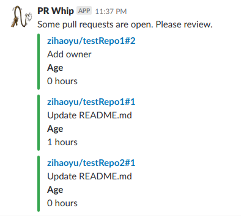

# pr-whip

 

An app that checks given Github repos at pre-defined time for open pull requests, and post notifications to specified Slack channels for attention.

> **whip** [**(h)wip**]
>
> _noun, 21:_<br/>
>
> _Politics._<br/>
> a. a party manager in a legislative body who secures attendance for voting and directs other members.<br/>
> b. (in Britain) a written call made on members of a party to be in attendance for voting.
>
> -- ["whip" on dictionary.com](https://www.dictionary.com/browse/whip)

## Build

Install [`dep`](https://github.com/golang/dep).

```
dep ensure
```

Get a [Github access token](https://help.github.com/articles/creating-a-personal-access-token-for-the-command-line/). The token should at least have `repo` [scope](https://developer.github.com/apps/building-oauth-apps/understanding-scopes-for-oauth-apps/).

Get a [Slack token](https://api.slack.com/custom-integrations/legacy-tokens).

## Config

See [`sample-config.yaml`](docs/sample-config.yaml) for details.

## Run

```
whip --github-api-key GITHUB_TOKEN --slack-api-key SLACK_TOKEN --config-file config.yaml
```

## Screenshot


